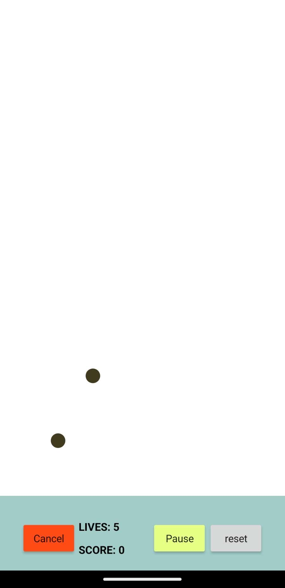

# 🎮 CatchABall - The Ultimate Ball-Catching Adventure!

<div align="center">

  <br>
  <em>Experience the thrill of catching falling balls in this exciting mobile game!</em>
</div>

## 🌟 Game Overview

CatchABall is an addictive mobile game that challenges your reflexes and hand-eye coordination. Race against time to catch falling balls and achieve the highest score possible!

### 🎯 Core Features

- 🏃‍♂️ Fast-paced gameplay
- 🎵 Engaging sound effects
- 📊 Real-time score tracking
- 🎨 Vibrant visuals
- 🔄 Progressive difficulty

## 🎮 How to Play

1. **Start the Game**
   - Launch CatchABall on your Android device
   - Tap 'Play' to begin your ball-catching adventure

2. **Game Controls**
   - Touch anywhere on the screen to catch falling balls
   - Quick reflexes = Higher scores!
   - Don't let the balls hit the ground

3. **Scoring System**
   - +1 point for each caught ball
   - Bonus points for catch streaks
   - Try to beat your high score!

## 🛠️ Technical Stack

### Development Platform
- **MIT App Inventor**
  - Visual programming environment
  - Drag-and-drop interface
  - Built-in Android emulator

### Backend Components
- **PHP Server Files** (in `backend_scripts/`)
  - `login.php` - User authentication system (1.3 KB)
  - `create.php` - New user registration (1.3 KB)
  - `read.php` - Fetch user data (1.9 KB)
  - `readHighscore.php` - Retrieve high scores (1.6 KB)
  - `change.php` - Update user information (2.0 KB)

### Database Integration
The game features an online high score system and user profiles through PHP-based backend services:
- User authentication
- Global leaderboard tracking
- Score persistence
- Profile management

### Game Components
```
📂 Root Directory (CatchABall/)
├── 📱 Game Files
│   ├── CatchABall.aia     (MIT App Inventor Project)
│   └── CatchABall.apk     (Android Application Package)
├── 🔐 backend_scripts/
│   ├── login.php          (Authentication)
│   ├── create.php         (User Registration)
│   ├── read.php           (Data Retrieval)
│   ├── change.php         (Profile Updates)
│   └── readHighscore.php  (Leaderboard)
├── 🎨 assets/
│   ├── IMG_2084.JPG       (Game Screenshot)
│   ├── mixkit-game-ball-tap-2073.wav        (Ball catch sound)
│   └── mixkit-completion-of-a-level-2063.wav (Level completion)
└── 📚 docs/
    ├── CATCHABALL_FINAL_PROJECT.docx  (Project Documentation)
    └── README.md                      (Project Guide)
```

_Note: All paths are relative to the project root directory._

All game files mentioned below can be found in the project root directory (`CatchABall/`).

## 📱 Installation Guide

### For Players
1. Download `CatchABall.apk` from the root directory (3.93 MB)
2. Enable "Unknown Sources" in Android Settings
3. Install and start catching balls!
4. Required Android version: 4.4 or higher

### For Developers
1. Visit [MIT App Inventor](http://ai2.appinventor.mit.edu/)
2. Import `CatchABall.aia` from the root directory
3. Customize and enhance the game

## 🎯 Game Assets

### Sound Effects
- Ball Catch: `assets/mixkit-game-ball-tap-2073.wav` (51.0 KB)
- Level Complete: `assets/mixkit-completion-of-a-level-2063.wav` (516 KB)

### Game Files
- Source Project (`CatchABall.aia`): 122.4 KB
  - MIT App Inventor project file
  - Contains all game logic and assets
- Android Package (`CatchABall.apk`): 3.93 MB
  - Ready to install on Android devices
  - Minimum Android version: 4.4 (KitKat)

### Required Files
| File Name | Purpose | Size |
|-----------|---------|------|
| CatchABall.aia | Source Project | 122.4 KB |
| CatchABall.apk | Android App | 3.93 MB |

## 💡 Pro Tips

- Keep your finger near the center for better reach
- Watch for patterns in ball drops
- Practice makes perfect!

## 🚀 Future Updates

We're planning exciting new features:
- 🌈 Multiple ball types
- ⚡ Power-ups
- 🤝 Multiplayer mode
- 🎨 New themes

## 🔧 Troubleshooting

Having issues? Try these:
1. Restart the game
2. Check device compatibility
3. Ensure sufficient storage
4. Update Android System WebView

## 📚 Documentation

The complete project documentation is available in:
- `docs/CATCHABALL_FINAL_PROJECT.docx` - Detailed project documentation
- `docs/README.md` - Quick start guide and project overview

---

<div align="center">
  
  <p>Test your reflexes by tapping balls appearing at random locations on the screen.</p>
  <p>Get started by downloading the APK or importing the .AIA file at <a href="https://appinventor.mit.edu/">MIT App Inventor</a>.</p>
  <br>
  <strong>Have fun and happy gaming! 🎯</strong>
</div>
